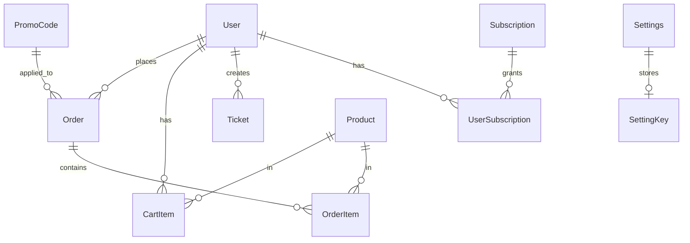

# E-commerce Website Specification - Phase 1

## Project: Car Dealership with Subscriptions

### Technology Stack

| Layer | Technology | Justification |
|-------|------------|---------------|
| **Frontend** | React 18 + Vite | Fast development, hot reload, smaller bundle size |
| **Language** | TypeScript | Type safety, better IDE support, easier maintenance |
| **Styling** | Tailwind CSS + Framer Motion | Rapid styling, modern animations |
| **Backend** | FastAPI | Modern, fast, auto-generated Swagger docs |
| **Database** | SQLite (dev) / PostgreSQL (prod) | Simple setup / Production ready |
| **Auth** | Google OAuth2 + Phone OTP | Social login + phone verification |
| **State** | Zustand | Lightweight, simple API, TypeScript support |
| **HTTP** | Axios | Interceptors, error handling |

### Database Schema



#### Tables

**users**
| Column | Type | Constraints |
|--------|------|-------------|
| id | INTEGER | PRIMARY KEY |
| phone | VARCHAR(20) | UNIQUE, NULLABLE |
| google_id | VARCHAR(255) | UNIQUE, NULLABLE |
| email | VARCHAR(255) | UNIQUE, NULLABLE |
| name | VARCHAR(255) | NOT NULL |
| avatar_url | TEXT | NULLABLE |
| is_admin | BOOLEAN | DEFAULT FALSE |
| created_at | DATETIME | DEFAULT CURRENT_TIMESTAMP |
| updated_at | DATETIME | DEFAULT CURRENT_TIMESTAMP |

**products (Cars)**
| Column | Type | Constraints |
|--------|------|-------------|
| id | INTEGER | PRIMARY KEY |
| name | VARCHAR(255) | NOT NULL |
| slug | VARCHAR(255) | UNIQUE |
| description | TEXT | NULLABLE |
| price | DECIMAL(12,2) | NOT NULL |
| category | VARCHAR(20) | 'premium' OR 'standard' |
| brand | VARCHAR(100) | NULLABLE |
| model | VARCHAR(100) | NULLABLE |
| year | INTEGER | NULLABLE |
| specs | JSON | NULLABLE (engine, transmission, etc.) |
| images | JSON | NULLABLE (array of URLs) |
| stock | INTEGER | DEFAULT 1 |
| is_active | BOOLEAN | DEFAULT TRUE |
| created_at | DATETIME | DEFAULT CURRENT_TIMESTAMP |
| updated_at | DATETIME | DEFAULT CURRENT_TIMESTAMP |

**subscriptions**
| Column | Type | Constraints |
|--------|------|-------------|
| id | INTEGER | PRIMARY KEY |
| name | VARCHAR(100) | NOT NULL |
| description | TEXT | NULLABLE |
| price | DECIMAL(10,2) | NOT NULL |
| duration_days | INTEGER | NOT NULL |
| features | JSON | NULLABLE (array of features) |
| is_active | BOOLEAN | DEFAULT TRUE |
| created_at | DATETIME | DEFAULT CURRENT_TIMESTAMP |

**orders**
| Column | Type | Constraints |
|--------|------|-------------|
| id | INTEGER | PRIMARY KEY |
| user_id | INTEGER | FOREIGN KEY → users.id |
| status | VARCHAR(20) | 'pending'/'paid'/'shipped'/'delivered'/'cancelled' |
| subtotal | DECIMAL(12,2) | NOT NULL |
| discount | DECIMAL(12,2) | DEFAULT 0 |
| total | DECIMAL(12,2) | NOT NULL |
| promo_code_id | INTEGER | FOREIGN KEY → promo_codes, NULLABLE |
| items | JSON | NOT NULL (array of order items) |
| shipping_address | JSON | NULLABLE |
| payment_method | VARCHAR(50) | NULLABLE |
| payment_status | VARCHAR(20) | 'pending'/'paid'/'failed' |
| created_at | DATETIME | DEFAULT CURRENT_TIMESTAMP |
| updated_at | DATETIME | DEFAULT CURRENT_TIMESTAMP |

**cart_items**
| Column | Type | Constraints |
|--------|------|-------------|
| id | INTEGER | PRIMARY KEY |
| user_id | INTEGER | FOREIGN KEY → users.id |
| product_id | INTEGER | FOREIGN KEY → products.id, NULLABLE |
| subscription_id | INTEGER | FOREIGN KEY → subscriptions.id, NULLABLE |
| quantity | INTEGER | DEFAULT 1 |
| created_at | DATETIME | DEFAULT CURRENT_TIMESTAMP |
| updated_at | DATETIME | DEFAULT CURRENT_TIMESTAMP |

**promo_codes**
| Column | Type | Constraints |
|--------|------|-------------|
| id | INTEGER | PRIMARY KEY |
| code | VARCHAR(50) | UNIQUE, NOT NULL |
| discount_type | VARCHAR(20) | 'percentage' OR 'fixed' |
| discount_value | DECIMAL(10,2) | NOT NULL |
| min_order_value | DECIMAL(12,2) | NULLABLE |
| valid_from | DATETIME | NOT NULL |
| valid_until | DATETIME | NOT NULL |
| usage_limit | INTEGER | NULLABLE (unlimited if NULL) |
| used_count | INTEGER | DEFAULT 0 |
| is_active | BOOLEAN | DEFAULT TRUE |
| created_at | DATETIME | DEFAULT CURRENT_TIMESTAMP |

**tickets**
| Column | Type | Constraints |
|--------|------|-------------|
| id | INTEGER | PRIMARY KEY |
| user_id | INTEGER | FOREIGN KEY → users.id |
| subject | VARCHAR(255) | NOT NULL |
| message | TEXT | NOT NULL |
| status | VARCHAR(20) | 'open'/'in_progress'/'resolved'/'closed' |
| ai_handled | BOOLEAN | DEFAULT FALSE |
| priority | VARCHAR(20) | 'low'/'medium'/'high' |
| created_at | DATETIME | DEFAULT CURRENT_TIMESTAMP |
| updated_at | DATETIME | DEFAULT CURRENT_TIMESTAMP |

**ticket_messages**
| Column | Type | Constraints |
|--------|------|-------------|
| id | INTEGER | PRIMARY KEY |
| ticket_id | INTEGER | FOREIGN KEY → tickets.id |
| user_id | INTEGER | FOREIGN KEY → users.id |
| message | TEXT | NOT NULL |
| is_from_admin | BOOLEAN | DEFAULT FALSE |
| created_at | DATETIME | DEFAULT CURRENT_TIMESTAMP |

**user_subscriptions**
| Column | Type | Constraints |
|--------|------|-------------|
| id | INTEGER | PRIMARY KEY |
| user_id | INTEGER | FOREIGN KEY → users.id |
| subscription_id | INTEGER | FOREIGN KEY → subscriptions.id |
| starts_at | DATETIME | NOT NULL |
| expires_at | DATETIME | NOT NULL |
| is_active | BOOLEAN | DEFAULT TRUE |
| created_at | DATETIME | DEFAULT CURRENT_TIMESTAMP |

**settings**
| Column | Type | Constraints |
|--------|------|-------------|
| key | VARCHAR(100) | PRIMARY KEY |
| value | TEXT | NOT NULL |
| updated_at | DATETIME | DEFAULT CURRENT_TIMESTAMP |

### API Endpoints

#### Authentication
| Method | Path | Description |
|--------|------|-------------|
| POST | /api/auth/register | Register with phone/email |
| POST | /api/auth/login | Login with credentials |
| POST | /api/auth/phone/verify | Verify phone OTP |
| POST | /api/auth/google | Google OAuth callback |
| GET | /api/auth/me | Get current user |
| POST | /api/auth/logout | Logout |

#### Products
| Method | Path | Description |
|--------|------|-------------|
| GET | /api/products | List all products (with filters) |
| GET | /api/products/{slug} | Get product details |
| GET | /api/products/featured | Get featured products |
| POST | /api/products | Create product (admin) |
| PUT | /api/products/{id} | Update product (admin) |
| DELETE | /api/products/{id} | Delete product (admin) |

#### Subscriptions
| Method | Path | Description |
|--------|------|-------------|
| GET | /api/subscriptions | List all subscriptions |
| GET | /api/subscriptions/{id} | Get subscription details |
| POST | /api/subscriptions/{id}/subscribe | Purchase subscription |

#### Cart
| Method | Path | Description |
|--------|------|-------------|
| GET | /api/cart | Get user cart |
| POST | /api/cart/items | Add item to cart |
| PUT | /api/cart/items/{id} | Update quantity |
| DELETE | /api/cart/items/{id} | Remove item |
| DELETE | /api/cart | Clear cart |
| POST | /api/cart/promo/apply | Apply promo code |
| DELETE | /api/cart/promo/remove | Remove promo code |

#### Orders
| Method | Path | Description |
|--------|------|-------------|
| GET | /api/orders | List user orders |
| GET | /api/orders/{id} | Get order details |
| POST | /api/orders | Create order |
| PUT | /api/orders/{id}/status | Update order status (admin) |

#### Promo Codes
| Method | Path | Description |
|--------|------|-------------|
| POST | /api/promo/validate | Validate promo code |
| GET | /api/promo | List promo codes (admin) |
| POST | /api/promo | Create promo code (admin) |
| PUT | /api/promo/{id} | Update promo code (admin) |
| DELETE | /api/promo/{id} | Delete promo code (admin) |

#### Tickets
| Method | Path | Description |
|--------|------|-------------|
| GET | /api/tickets | List user tickets |
| GET | /api/tickets/{id} | Get ticket details |
| POST | /api/tickets | Create ticket |
| PUT | /api/tickets/{id} | Update ticket |
| POST | /api/tickets/{id}/messages | Add message to ticket |
| PUT | /api/tickets/{id}/close | Close ticket |

#### Settings
| Method | Path | Description |
|--------|------|-------------|
| GET | /api/settings | Get all settings |
| GET | /api/settings/{key} | Get setting by key |
| PUT | /api/settings/{key} | Update setting (admin) |
| PUT | /api/settings/maintenance | Toggle maintenance mode (admin) |

### Frontend Component Architecture

```
src/
├── components/
│   ├── layout/
│   │   ├── Header/
│   │   │   ├── Header.tsx
│   │   │   ├── Logo.tsx
│   │   │   ├── Navigation.tsx
│   │   │   └── UserMenu.tsx
│   │   ├── Footer/
│   │   │   ├── Footer.tsx
│   │   │   ├── FooterLinks.tsx
│   │   │   └── ContactInfo.tsx
│   │   └── Layout.tsx
│   │
│   ├── products/
│   │   ├── ProductCard.tsx
│   │   ├── ProductGrid.tsx
│   │   ├── ProductDetail.tsx
│   │   ├── ProductGallery.tsx
│   │   ├── ProductSpecs.tsx
│   │   ├── CategoryFilter.tsx
│   │   └── PriceFilter.tsx
│   │
│   ├── cart/
│   │   ├── CartDrawer.tsx
│   │   ├── CartItem.tsx
│   │   ├── CartSummary.tsx
│   │   ├── PromoInput.tsx
│   │   └── ProductFlyAnimation.tsx
│   │
│   ├── auth/
│   │   ├── LoginModal.tsx
│   │   ├── PhoneInput.tsx
│   │   ├── PhoneVerification.tsx
│   │   ├── GoogleButton.tsx
│   │   └── AuthGuard.tsx
│   │
│   ├── contact/
│   │   ├── FloatingContactButton.tsx
│   │   ├── ChatWidget.tsx
│   │   ├── ChatMessage.tsx
│   │   ├── ChatInput.tsx
│   │   └── OnlineStatus.tsx
│   │
│   ├── admin/
│   │   ├── Dashboard.tsx
│   │   ├── ProductForm.tsx
│   │   ├── OrderList.tsx
│   │   ├── TicketList.tsx
│   │   ├── PromoCodeForm.tsx
│   │   └── SettingsPanel.tsx
│   │
│   └── ui/
│       ├── Button.tsx
│       ├── Input.tsx
│       ├── Modal.tsx
│       ├── Toast.tsx
│       ├── Skeleton.tsx
│       └── Badge.tsx
│
├── pages/
│   ├── Home.tsx
│   ├── Catalog.tsx
│   ├── ProductPage.tsx
│   ├── CartPage.tsx
│   ├── Checkout.tsx
│   ├── Orders.tsx
│   ├── OrderDetail.tsx
│   ├── Profile.tsx
│   ├── Subscriptions.tsx
│   ├── Contact.tsx
│   ├── AdminDashboard.tsx
│   ├── AdminProducts.tsx
│   ├── AdminOrders.tsx
│   ├── AdminTickets.tsx
│   └── AdminSettings.tsx
│
├── stores/
│   ├── authStore.ts
│   ├── cartStore.ts
│   ├── productStore.ts
│   └── uiStore.ts
│
├── hooks/
│   ├── useAuth.ts
│   ├── useCart.ts
│   ├── useProducts.ts
│   └── useToast.ts
│
├── services/
│   ├── api.ts
│   ├── auth.ts
│   ├── products.ts
│   ├── cart.ts
│   └── orders.ts
│
├── types/
│   ├── index.ts
│   ├── product.ts
│   ├── user.ts
│   └── order.ts
│
└── utils/
    ├── formatPrice.ts
    ├── formatDate.ts
    └── validation.ts
```

### Animation Strategy

| Component | Animation | Library |
|-----------|-----------|----------|
| Product Card | Hover scale, shadow lift | Framer Motion |
| Cart Drawer | Slide from right | Framer Motion |
| Product Fly | Flying item to cart icon | Framer Motion |
| Page Transitions | Fade + slide | Framer Motion |
| Buttons | Press scale, ripple | CSS + Framer |
| Modals | Scale + fade | Framer Motion |
| Loading | Skeleton shimmer | CSS |
| Chat Widget | Slide up/down | Framer Motion |

### Business Hours & Contact Logic

```typescript
interface BusinessHours {
  open: string;  // "10:00"
  close: string; // "22:00"
  timezone: string; // "Europe/Kiev"
}

// Display logic:
// 10:00-22:00: Show "Chat with us" + operator available
// 22:00-10:00: Show "Chat with AI Bot" + offline message
```

### Implementation Priorities

#### Phase 1 (Foundation)
1. Project setup (Vite + React + TypeScript + Tailwind)
2. Backend setup (FastAPI + SQLite)
3. Database models and migrations
4. Basic authentication (JWT)
5. Product CRUD API

#### Phase 2 (Core Features)
1. Product catalog with filters
2. Shopping cart with persistence
3. Promo code system
4. Order creation flow

#### Phase 3 (Enhancements)
1. Google OAuth integration
2. Phone authentication
3. Contact chat widget with AI
4. Admin panel

#### Phase 4 (Polish)
1. Animations and transitions
2. Product fly animations
3. Loading states and skeletons
4. Mobile responsive design

### Configuration Files Structure

```
d:/MYPROJECT/
├── backend/
│   ├── app/
│   │   ├── main.py
│   │   ├── config.py
│   │   ├── database.py
│   │   ├── models/
│   │   │   ├── user.py
│   │   │   ├── product.py
│   │   │   ├── order.py
│   │   │   └── ...
│   │   ├── schemas/
│   │   │   ├── user.py
│   │   │   ├── product.py
│   │   │   └── ...
│   │   ├── routers/
│   │   │   ├── auth.py
│   │   │   ├── products.py
│   │   │   ├── cart.py
│   │   │   └── ...
│   │   └── utils/
│   ├── requirements.txt
│   └── .env
│
├── frontend/
│   ├── src/
│   │   ├── components/
│   │   ├── pages/
│   │   ├── stores/
│   │   ├── services/
│   │   ├── hooks/
│   │   ├── types/
│   │   ├── utils/
│   │   ├── App.tsx
│   │   └── main.tsx
│   ├── index.html
│   ├── package.json
│   ├── tsconfig.json
│   ├── vite.config.ts
│   └── tailwind.config.js
│
└── SPEC.md
```

### Sample Data

**Products (Cars)**
- 18 Premium cars (Mercedes, BMW, Audi, Porsche, etc.)
- 28 Standard cars (Toyota, Honda, Ford, Hyundai, etc.)
- Each with: name, description, price, specs, images

**Subscriptions**
1. Basic - 30 days access to standard inventory
2. Premium - 30 days access to all cars + priority support

### Next Steps

1. Initialize project with Vite + React + TypeScript
2. Set up FastAPI backend with SQLAlchemy
3. Create database migrations
4. Implement authentication system
5. Build product catalog
6. Implement shopping cart
7. Add admin panel
8. Add animations and polish
